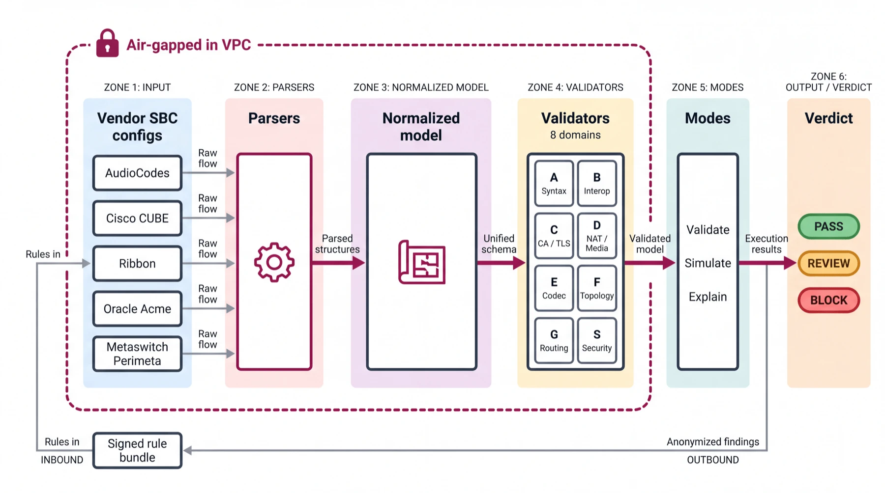
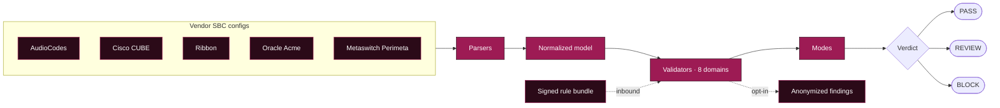
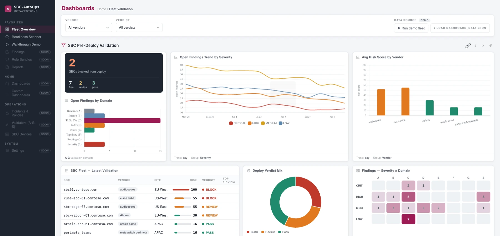

<div align="center">


<br/>

[](https://github.com/Dicoangelo)

[](https://sbcvalidator.metaventionsai.com)
[](https://sbcvalidator.metaventionsai.com/scanner)
[](#license)

<br/>


<br/><br/>


<br/>

*Reads any SBC vendor's config before deploy and tells you, in plain English, exactly what will break. Local-first and air-gapped: raw configs never leave your environment.*

</div>

<br/>

> **Every business call crosses a Session Border Controller** — the fragile, multi-vendor gateway between your network and the carrier. One misconfiguration and calls fail silently: one-way audio, dead trunks, hours of repair, and you hear about it from users, not a dashboard. SBC-AutoOps is the independent layer that catches the break in the **config**, before you ship it.

<br/>

## Architecture

<div align="center">

</div>



<div align="center">

```
   VALIDATE              →            PREDICT             →           EXPLAIN
   read the config                    model the call                 diagnose a capture
   across 8 domains                   TLS → SIP → SDP → media         reconstruct the SIP ladder

   ════════════════════════════════════════════════════════════════════════════════════════

   • Deterministic verdicts, not LLM guesses        • Air-gapped, local-first execution
   • Microsoft-authoritative 2026 CA / EKU rules    • Ed25519-signed rulesets, rollback refusal
   • Refuses to guess: silent where it cannot prove • Five vendors, one normalized model
```

</div>

<br/>

## Five vendors, one model

| Vendor | Format | Depth |
|---|---|---|
| **AudioCodes** | `.ini` (table + simple) | Full: TLS, cert, SRTP, codec, NAT, routing, security |
| **Cisco CUBE** | IOS-XE | TLS, cert, SRTP, codec, NAT (routing/security roadmap) |
| **Ribbon** | SBC Core `set-config` | TLS, cert, SRTP, codec, NAT (routing/security roadmap) |
| **Oracle Acme** | Acme Packet ACLI | TLS, cert, SRTP, codec, NAT (routing/security roadmap) |
| **Metaswitch Perimeta** | adjacency CLI | Interop / transport posture. Trust store, cert and codec live outside the export, so those domains stay silent and are verified out of band. |

*The engine refuses to guess. Where a config format cannot prove a fact, the verdict says "verify out-of-band" rather than inventing one.*

## Eight validation domains

| | Domain | Catches |
|---|---|---|
| **A** | Syntax / semantic | Malformed config, dangling references |
| **B** | Interop | TLS transport, OPTIONS keep-alive, header normalization |
| **C** | TLS / CA — *the 2026 wedge* | Missing Microsoft roots, mTLS off, SRTP off, EKU, chain validity |
| **D** | NAT / media | Private IP in SDP, missing symmetric RTP → one-way audio |
| **E** | Codec | Cross-leg overlap, forced transcode, DTMF |
| **F** | Topology leak | Private-IP leakage on the signaling plane |
| **G** | Routing / classification | 404 / unclassified Teams routing |
| **S** | Security | ACL default-deny, broad CIDR, shadowing |

## Quick start

```bash
# one packaged command runs the whole demo-fleet showcase
sbc-validator demo

# validate a single config (any of the five vendors auto-detected)
sbc-validator validate sbc-configs/teams.ini \
    --ruleset rulesets/ms_direct_routing_2026-06.json \
    --html report.html

# predict the call, diagnose a capture, diff an HA pair, roll up a fleet
sbc-validator simulate sbc-configs/teams.ini
sbc-validator explain capture.pcap
sbc-validator diff active.ini standby.ini --fail-on review
sbc-validator fleet sbc-configs/

# map findings to a regulatory control framework
sbc-validator report --compliance mifid2 --results results/

# outside-in: live TLS handshake to an SBC edge, graded vs the ruleset
sbc-validator probe sbc.contoso.com

# the local console: fleet view, findings, reports, bundle provenance
# (reads results/, never leaves the box)
sbc-validator serve
```

`validate` returns a non-zero exit code, so it drops straight into CI and fails the build before a non-compliant config reaches the change window.

## See it

<div align="center">

</div>

- **[Live business case](https://sbcvalidator.metaventionsai.com)** — the product, the 2026 deadline, the market
- **[Security & data handling](https://sbcvalidator.metaventionsai.com/#security)** — the data-flow contract, stated precisely
- **[Live dashboard demo](https://sbcvalidator.metaventionsai.com/dashboard/)** — the fleet view, sample data
- **[Setup Guide](https://sbcvalidator.metaventionsai.com/dashboard/#setup)** — the four run paths, copy-paste ready
- **[Free readiness scanner](https://sbcvalidator.metaventionsai.com/scanner)** — outside-in TLS grade for any SBC FQDN; edge-only, unauthenticated, stores nothing (grades + check IDs aggregate only, never hostnames)
- **[State-of-readiness benchmark](https://sbc-autoops-scanner.fly.dev/stats)** — anonymized aggregate grades

## Security & data handling

The data-flow contract is documented precisely in **[docs/SECURITY.md](docs/SECURITY.md)**,
written to be lifted into a security review. The short version:

- **Inbound, one channel:** a versioned, Ed25519-signed rule bundle, verified before use
  against a publisher key pinned in source (`sbc_validator/rules/client.py`), with a
  compiled-in freshness floor that refuses rollback. Configs never travel this channel.
- **Outbound, default:** nothing. No telemetry, no call-home. `docker run --network none`
  is the documented production mode.
- **Outbound, opt-in (`--share-anon`):** check IDs, severities, vendor family, ruleset
  version, salted org token. Never config text, FQDNs, CN/SAN, IPs, or file paths
  (`sbc_validator/report/anonymize.py`).
- **Verify, don't trust:** build from source on your side. `sha256sum -c SHA256SUMS`
  verifies the tree (regenerate with `scripts/integrity-manifest.sh`); a runtime
  CycloneDX SBOM ships at `docs/sbom-cyclonedx.json`. One runtime dependency
  (`cryptography`). Docker is packaging, not a requirement: plain `pip install .` on
  any Python 3.10+ host, fully-offline wheel installs, and rootless Podman all work.

## What's verified, stated up front

Capabilities described as available are implemented and tested (**182 tests in CI**, three Python versions). Routing and security depth for Cisco, Ribbon, and Oracle, per-config cipher matching, and live probing stay **silent** until validated against a real config for that vendor. Metaswitch Perimeta is read from an adjacency-CLI export that does not carry the trust store, certificate, or codec policy inline, so those domains stay silent for it. The tool refuses to guess — a wrong verdict is the one thing a pre-deployment control cannot afford.

## Project layout

```
sbc_validator/
  models.py              normalized vendor-neutral config model
  cli.py                 entrypoint: validate/simulate/explain/diff/fleet/serve/report/probe/demo
  parsers/               audiocodes, cisco_cube, ribbon, oracle, perimeta (Metaswitch)
  validators/            A syntax, B interop, C ca/tls, D nat, E codec, ha_drift, G routing, S security
  report/                risk, html (per-SBC), exec (fleet), compliance (control frameworks), anonymize
  rules/client.py        signed, versioned, rollback-floored rule-bundle client
  call_sim.py            deterministic call-flow prediction (TLS → SIP → SDP → media)
  web/                   the packaged dashboard + scanner front-ends
marketing/               the business case, architecture diagrams, hosted demo dashboard
rulesets/                Microsoft-authoritative 2026 Direct Routing rule bundle (Ed25519-signed)
```

<br/>

## License

Proprietary — © 2026, all rights reserved. Not licensed for redistribution. A commercial product in active development; partnership and design-partner inquiries welcome.

<br/>

<div align="center">

**Built by [Dico Angelo](https://github.com/Dicoangelo)** — AI builder and systems architect.
**Telecom architecture by Philip Drammeh** — ex-Microsoft Teams Direct Routing specialist.

*Telecom domain depth meets AI build velocity.*

</div>


