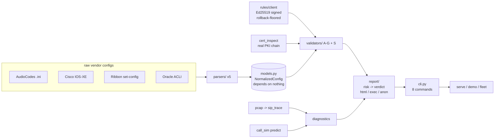

# SBC Validator: Architecture

~4,700 LOC, 29 modules, **one runtime dependency** (`cryptography`). The pcap
reader, HTTPS rule client, and dashboard server are all hand-rolled on the stdlib,
so the tool audits clean and runs fully air-gapped (`docker run --network none`).

## The contract-centred pipeline

Every layer speaks one vendor-neutral shape (`NormalizedConfig`). Parsers produce
it; validators consume it; they never touch each other. That is why "five vendors,
one engine" is true by construction, not by claim.



ASCII view of the same flow:

```
 vendor config --> parsers/ --> NormalizedConfig --> validators/ --> Findings
                                      ^                                 |
                signed ruleset -------+                                 v
                real cert (PKI) ------+                 report/ risk -> PASS/REVIEW/BLOCK
 capture --> pcap -> sip_trace --\                                      |
 config  --> call_sim -----------/--> diagnose ----------------------> cli -> serve/demo/fleet
```

## Layers and responsibilities

| Layer | Modules | Responsibility |
|---|---|---|
| **Contract** | `models.py` (128 LOC) | `NormalizedConfig` — the shape every layer reads. Imports nothing; the keystone. |
| **Parsers** | `parsers/*` (5) | raw vendor config -> model. Validators never import these (vendor-agnostic). |
| **Validators** | `validators/*` (9: A-G, S) | model -> `Finding[]`. Each a pure `(config, ruleset) -> result` over `base.py`. |
| **Diagnostics** | `call_sim`, `sip_trace`+`pcap`, `cert_inspect` | predict the call / post-mortem a capture / real PKI. Deterministic, offline. |
| **Trust** | `rules/client` | the only inbound channel: signed, verified-before-use, rollback-floored. |
| **Output** | `report/*` | findings -> score, verdict (`risk.py`, 30 LOC), HTML, opt-in anon payload. |
| **Surfaces** | `cli`, `serve`, `demo`, `fleet` | orchestration; `cli.py` wires the eight commands. |

## Patterns (consistent, deliberate)

- **Strategy + uniform interface.** Every validator subclasses `AbstractValidator`;
  every parser emits the same model. Adding a vendor or a domain is additive.
- **Tristate / gating discipline.** `None = unknown` -> validators stay silent
  (`is False`). "Silence beats a wrong verdict" is enforced in the types, not docs.
- **Unidirectional dependency flow.** `parsers -> models <- validators -> report`.
  No cycles; the model is a sink everything reads.
- **Pure core, I/O at the edges.** Validators and scoring are side-effect-free; all
  network/file/render I/O lives in `cli`, `serve`, `rules`, `report`.

## Known debt (named, concentrated)

1. `cli.py` (418 LOC) is the wiring hub: arg parsing + 8 handlers. Fine until ~500
   LOC or a 9th command, then split into a `commands/` package.
2. `ca_compliance.py` (380 LOC) is the densest validator (mTLS, SRTP, roots, chain,
   EKU, expiry, FQDN). Cert-leaf logic is factored into `validators/cert_checks.py`.
3. Tristate is half-applied: model + AudioCodes parser are honest; Cisco/Ribbon/
   Oracle still guess `False` until a real config (PRD COV-002).
4. The dashboard is a single HTML file: fine for a local viewer; the drag-drop
   validate feature (PRD OPS-004) will push it toward real structure.

## Design rules that must hold

- **One runtime dependency.** Guarded by a ratchet test; resist a web framework for
  OPS-004 (extend the stdlib `serve.py` instead).
- **Raw configs never leave the host.** Parsing/validation are pure-local; the only
  inbound is a signed rule bundle; the only (opt-in, double-gated) outbound is an
  anonymized check-id/severity payload.
